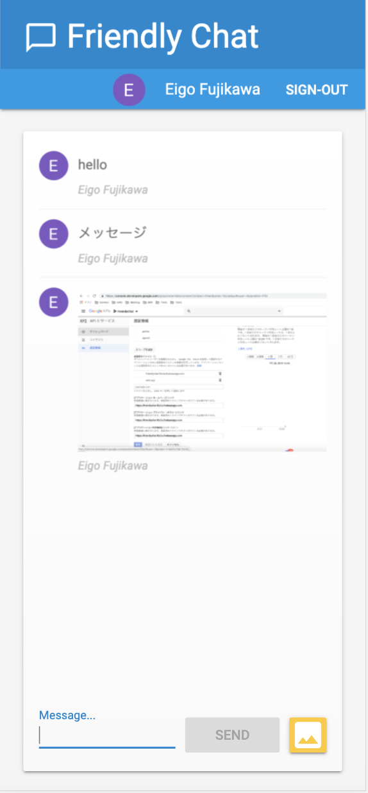

# README



## Commands

```
$ npm -g install firebase-tools
$ firebase --version
$ firebase login
$ firebase use --add
$ firebase serve
$ firebase deploy
```

## Output

https://friendlychat-f6c3a.firebaseapp.com

## 詰まった点
* Cloud Authentication
  Signin しようとすると、403エラーが表示されて、Google Provider認証がエラーになる-> OAuthへ同意する。アプリケーション ホームページ] リンクと[アプリケーション プライバシー ポリシー] リンクが必要
  - [API とサービス / 認証情報](https://console.developers.google.com/apis/credentials/consent?project={xxxx})

* Cloud FireStore
  * エラー `writing new message to Firebase Database FirebaseError: Missing or insufficient permissions` の対処
    - Filre store ruleで request.authがnullではない場合だけ許可するように書き換え
    - test modeで作っていれば発生しなかった模様だが、
    - Firestoreのデータベースを初期設定する際のモード選択で、lock modeを選んで作成したことで発生
    - FirestoreのRule初期設定が、test mode(Codelabで指示された方)を選んだ場合とlock modeを選んだ場合で異なる模様
       - https://console.firebase.google.com/u/1/project/friendlychat-f6c3a/database/firestore/rules

    - 以下のように変更した
    
    ```
    rules_version = '2';
    service cloud.firestore {
        match /databases/{database}/documents {
            match /{document=**} {
                allow read, write: if false;
            }
        }
    }

    ↓

    rules_version = '2';
    service cloud.firestore {
    match /databases/{database}/documents {
        match /{document=**} {
        allow read, write: if request.auth != null;
        }
    }
    }
    ```

  * Firestore内のデータ構造の単位
    - collections, documents, fields, and subcollections
  * FirestoreにSDK経由で最初のメッセージ書き込みを行ったタイミングで自動でmessagesコレクションが作成されたのを確認した
     - messagesコレクションは、あらかじめFireBaseのコンソールで作っておかなくてもOK。
        - messagesコレクションはConsoleで作成する場合は、１つ目のdocumentを作成させられる。
  

* Developer Console Memo

```
[2019-07-21T04:09:44.477Z]  @firebase/firestore: Firestore (6.3.0): 
  The timestampsInSnapshots setting now defaults to true and you no
  longer need to explicitly set it. In a future release, the setting
  will be removed entirely and so it is recommended that you remove it
  from your firestore.settings() call now.
```

* Cloud Storage:  is better suited for storing files

* Cloud Messaging 
  - publicディレクトとりに配置するmanifest.jsonファイルの中に記載するgcm_sender_idはFirebase Cloud Messagingを使う場合、 `103953800507` 
    - 変えてはいけない

```
Unable to get messaging token. FirebaseError: Messaging: We are unable to register the default service worker. Failed to register a ServiceWorker: A bad HTTP response code (404) was received when fetching the script. (messaging/failed-serviceworker-registration).
```

* Performance Monitoring

  - 早速FirebaseのConsole上で確認してみたが、表示されない。
    - 最初のデータは 12時間程度待つと表示されるとのこと。
  - そもそもログが飛んでいるのかの確認は、ChromeのDeveloperコンソールでログをみる
    - FriendlychatをデプロイしたfirebaseのホストURLをChromeで開く
      - https://friendlychat-f6c3a.firebaseapp.com
    - ChromeのDeveloperコンソールを開いて、Networkタブをチェック
      - firebaselogging.googleapis.comに対してリクエストが送信されていることを確認できればOK
         - https://firebaselogging.googleapis.com/v0cc/log?format=json_proto
    - 送信されてなければ、以下のfirebase-performance.jsの読み込みとオブジェクトの初期化が行われてるか再確認

```
<script src="/__/firebase/6.3.0/firebase-performance.js"></script>
<script>
  var perf = firebase.performance();
</script>
```
    - 
